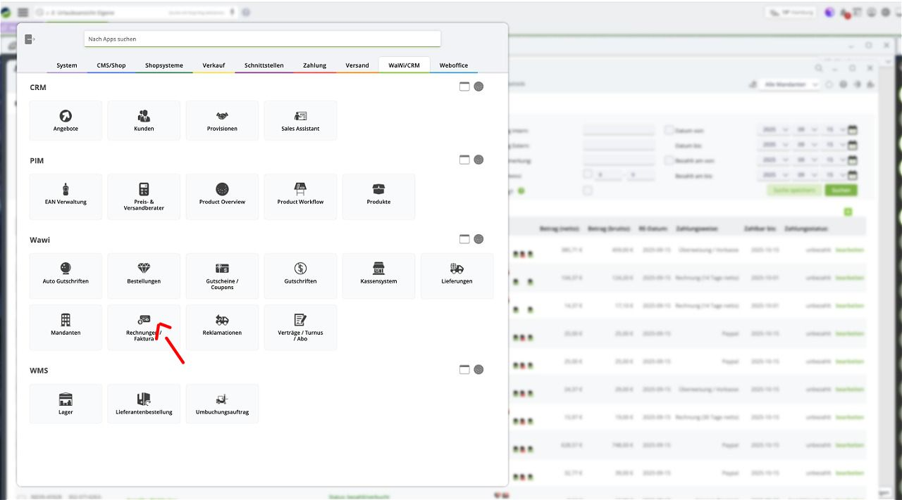
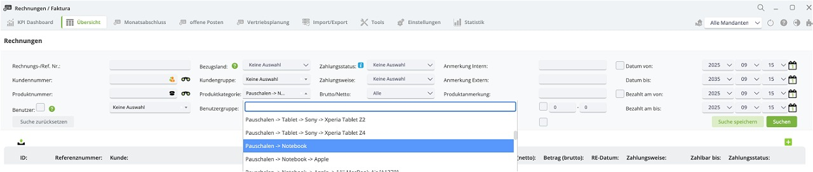
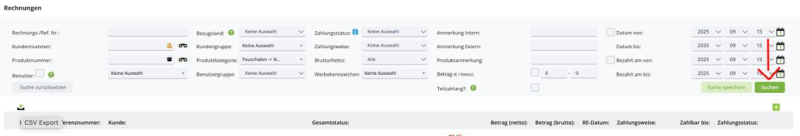
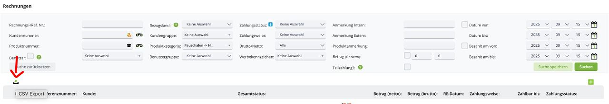
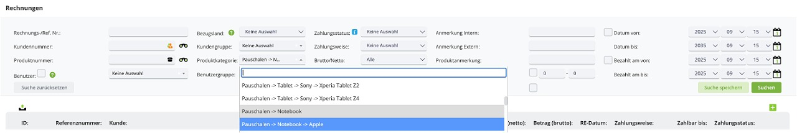

# CSV Merger – Benutzerhandbuch  

---

## Erste Schritte  

### Dateien abrufen  

Zuerst müssen wir zu Tricoma gehen:  
https://www.justcom-wawi.de/cmssystem/  

In Tricoma gehen wir zu:  
Reiter **WaWi/CRM -> Rechnungen/Faktura** 

Als Nächstes wählen wir die Produktkategorie aus, z. B. **Pauschalen -> Notebook**:  

  

Dann klicken wir rechts auf **Suchen**, um die Filter zu bestätigen:  

  

Danach klicken wir auf den Button links, um die CSV zu exportieren und zu speichern:  

 

Anschließend wiederholen wir den gleichen Vorgang, jedoch nur für **Apple-Produkte**, in der gewünschten Gerätekategorie:  

---

### Anwendung ausführen  

#### Als ausführbare Datei starten (Empfohlen)  

1. Laden Sie die neueste ausführbare Datei im Bereich **Releases** herunter:  
   https://github.com/halocore099/CSV  

2. Entpacken Sie die ZIP-Datei (falls zutreffend)  

3. Führen Sie die ausführbare Datei aus:  
   - **Windows:** `CSV Merger.exe`  
   - **macOS/Linux:** `CSV Merger`  
   

---

## Schritt-für-Schritt-Anleitung  

### 1. Anwendung starten  

- Öffnen Sie die CSV-Merger-Anwendung  
- Es erscheint ein Fenster mit Dateiauswahlfeldern und Optionen  

### 2. Eingabedateien auswählen  

#### Gesamte CSV-Datei  

- Klicken Sie auf **Browse** neben "Total CSV"  
- Wählen Sie die erste exportierte Datei aus Tricoma aus  
- Diese Datei wird im Ergebnis als **"Non-Apple"** gekennzeichnet  

#### Apple-CSV-Datei  

- Klicken Sie auf **Browse** neben "Apple CSV"  
- Wählen Sie die zweite exportierte Datei aus Tricoma aus  
- Diese Datei wird im Ergebnis als **"Apple"** gekennzeichnet  

---

### 3. Trennzeichen konfigurieren (Optional)  

- Die Anwendung erkennt automatisch gängige Trennzeichen: `, ; | \t`  
- Wenn Ihre Dateien ein anderes Trennzeichen verwenden, tragen Sie dieses im Feld **Delimiter** ein  
- Lassen Sie das Feld leer für automatische Erkennung  

---

### 4. Dateien zusammenführen  

- Klicken Sie auf den Button **Merge CSVs**  
- Während der Verarbeitung wird der Status **"Merging CSVs..."** angezeigt  
- Nach Abschluss erscheint: **"Merge complete! Saved to: merged_output.csv"**  

---

### 5. Ergebnisdatei finden  

- Die zusammengeführte Datei wird als `merged_output.csv` im gleichen Verzeichnis gespeichert wie die Anwendung  
- Das Ergebnis enthält alle Spalten beider Eingabedateien plus eine neue Spalte **"Brand Type"**  

---

